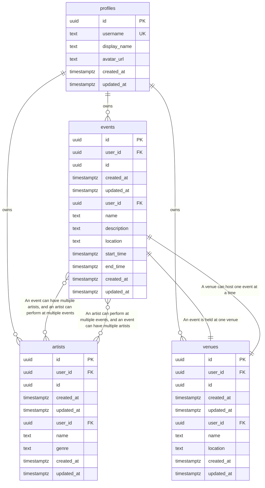

# Entity Relationship Diagram - SoundScout Explore

> **Auto-generated** from your idea analysis
> **Entities:** 3

---

## Visual Diagram

---

## Entity Details

### Event
> Live music event

**Fields:**
  - `id`: uuid (required) - Primary key
  - `created_at`: datetime (required) - Creation timestamp
  - `updated_at`: datetime (required) - Last update timestamp
  - `user_id`: uuid (required) - Owner user ID
  - `name`: string (required, indexed) - Event name
  - `description`: text - Event description
  - `location`: string (required, indexed) - Event location
  - `start_time`: datetime (required, indexed) - Event start time
  - `end_time`: datetime (required, indexed) - Event end time

**Relationships:**
  - many_to_many → **Artist**: An event can have multiple artists, and an artist can perform at multiple events
  - one_to_one → **Venue**: An event is held at one venue

### Artist
> Music artist

**Fields:**
  - `id`: uuid (required) - Primary key
  - `created_at`: datetime (required) - Creation timestamp
  - `updated_at`: datetime (required) - Last update timestamp
  - `user_id`: uuid (required) - Owner user ID
  - `name`: string (required, indexed) - Artist name
  - `genre`: string - Artist genre

**Relationships:**
  - many_to_many → **Event**: An artist can perform at multiple events, and an event can have multiple artists

### Venue
> Music venue

**Fields:**
  - `id`: uuid (required) - Primary key
  - `created_at`: datetime (required) - Creation timestamp
  - `updated_at`: datetime (required) - Last update timestamp
  - `user_id`: uuid (required) - Owner user ID
  - `name`: string (required, indexed) - Venue name
  - `location`: string (required, indexed) - Venue location

**Relationships:**
  - one_to_one → **Event**: A venue can host one event at a time

---

## Notes

- All entities have standard fields: `id`, `user_id`, `created_at`, `updated_at`
- `PK` = Primary Key, `FK` = Foreign Key, `UK` = Unique Key
- Copy the Mermaid code block to visualize in any Mermaid-compatible tool
- Relationships: `||--o{` = one-to-many, `||--||` = one-to-one, `}o--o{` = many-to-many
